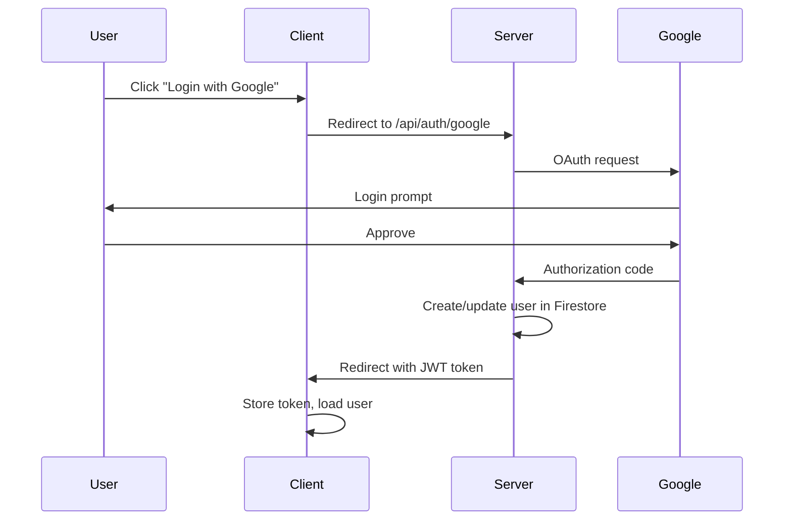
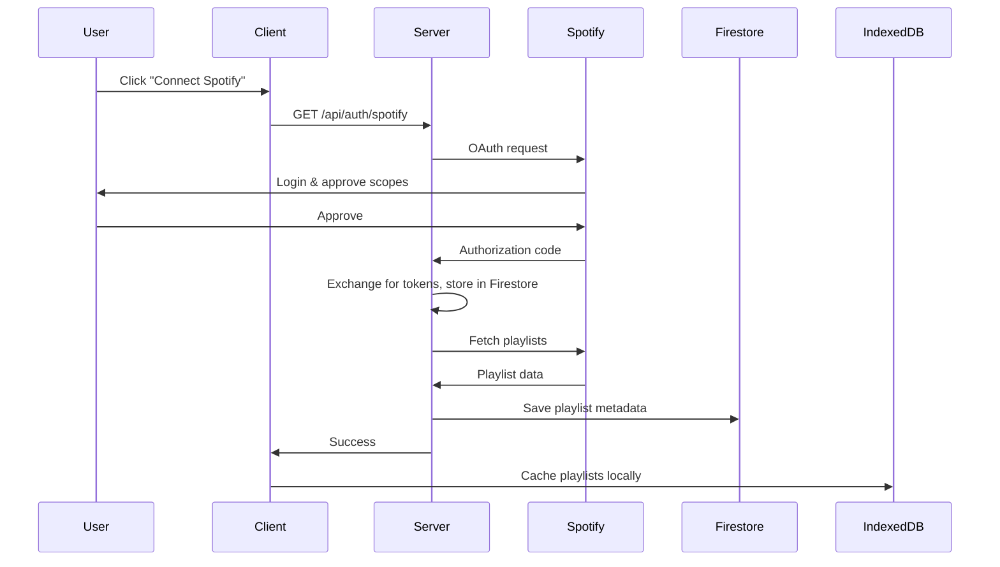
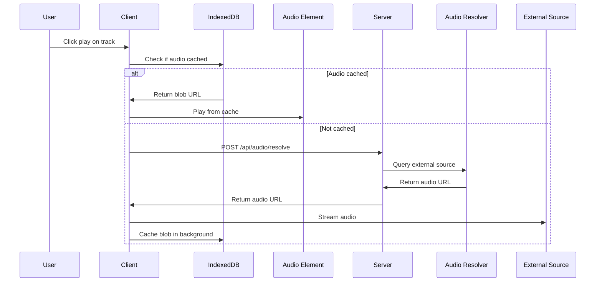
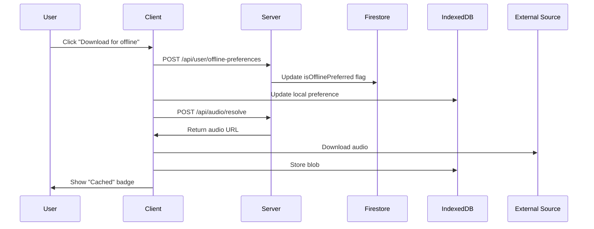

# SK Music - Offline-First Music Streaming PWA

A Progressive Web App (PWA) for streaming music with **offline-first architecture**, integrating Spotify playlists with local audio caching. Built for personal and educational use.

## 🎯 Key Features

- **Google OAuth** - Primary user authentication
- **Spotify Integration** - Sync playlists and metadata via Spotify Web API
- **Offline-First** - IndexedDB storage for metadata, local audio cache
- **Cross-Device Sync** - Cloud stores preferences, each device caches audio independently
- **PWA** - Installable, works offline, service worker caching
- **Modern UI** - Spotify-inspired dark theme with Tailwind CSS

## ⚖️ Legal & Architecture

### Critical Rules

✅ **LEGAL**
- Uses Spotify API **ONLY for metadata** (track names, artists, albums, artwork)
- Audio resolved from **external public sources** (NOT Spotify)
- For **personal and educational use only**

❌ **NEVER**
- Store audio files in the cloud
- Use Spotify's audio streams or DRM content
- Enable bulk download or piracy features
- Use Spotify branding/logos without permission

### Architecture Overview

```
┌─────────────────────────────────────────────────────────────┐
│                        CLIENT (Browser)                      │
├─────────────────────────────────────────────────────────────┤
│  React + TypeScript + Tailwind CSS                          │
│  ├─ Auth: Google OAuth, Spotify OAuth                       │
│  ├─ IndexedDB: Playlists, Tracks, Metadata                  │
│  ├─ Audio Cache: Blob storage (LOCAL ONLY)                  │
│  └─ Service Worker: App shell, metadata, artwork            │
└─────────────────────────────────────────────────────────────┘
                              ↕
┌─────────────────────────────────────────────────────────────┐
│                    SERVER (Node.js/Express)                  │
├─────────────────────────────────────────────────────────────┤
│  ├─ Auth: Passport.js (Google), JWT                         │
│  ├─ Spotify Service: Token refresh, playlist sync           │
│  ├─ Audio Resolver: External API integration                │
│  └─ Firestore: User data, playlists, tracks (NO AUDIO)      │
└─────────────────────────────────────────────────────────────┘
                              ↕
┌─────────────────────────────────────────────────────────────┐
│                      EXTERNAL SERVICES                       │
├─────────────────────────────────────────────────────────────┤
│  ├─ Google OAuth API                                        │
│  ├─ Spotify Web API (metadata only)                         │
│  ├─ Firebase/Firestore (metadata only)                      │
│  └─ Audio Resolver API (external audio sources)             │
└─────────────────────────────────────────────────────────────┘
```

### Data Storage Strategy

| Data Type | Storage Location | Synced Across Devices |
|-----------|------------------|----------------------|
| User profile | Firestore | ✅ Yes |
| Playlists (metadata) | Firestore + IndexedDB | ✅ Yes |
| Tracks (metadata) | Firestore + IndexedDB | ✅ Yes |
| Offline preferences | Firestore | ✅ Yes |
| **Audio files** | **IndexedDB (LOCAL ONLY)** | ❌ **NO** |

## 🚀 Getting Started

### Prerequisites

- Node.js >= 18.0.0
- npm >= 9.0.0
- Google Cloud Console project (OAuth)
- Spotify Developer account (OAuth)
- Firebase project (Firestore)
- External audio resolver API (optional)

### 1. Clone & Install

```bash
cd "d:\SK Music"
npm run install:all
```

### 2. Environment Configuration

Copy `.env.example` to `.env` and configure:

```bash
# Server Configuration
NODE_ENV=development
PORT=5000
CLIENT_URL=http://localhost:5173

# Google OAuth
GOOGLE_CLIENT_ID=your-google-client-id
GOOGLE_CLIENT_SECRET=your-google-client-secret
GOOGLE_REDIRECT_URI=http://localhost:5000/api/auth/google/callback

# Spotify OAuth
SPOTIFY_CLIENT_ID=your-spotify-client-id
SPOTIFY_CLIENT_SECRET=your-spotify-client-secret
SPOTIFY_REDIRECT_URI=http://localhost:5000/api/auth/spotify/callback

# Session & Security
SESSION_SECRET=your-random-session-secret-min-32-chars
JWT_SECRET=your-random-jwt-secret-min-32-chars

# Firebase/Firestore
FIREBASE_PROJECT_ID=your-project-id
FIREBASE_CLIENT_EMAIL=your-service-account-email
FIREBASE_PRIVATE_KEY=your-private-key

# Audio Resolver (optional)
AUDIO_RESOLVER_API_URL=https://your-audio-resolver-api.com
AUDIO_RESOLVER_API_KEY=your-api-key
```

### 3. Setup OAuth

#### Google OAuth Setup

1. Go to [Google Cloud Console](https://console.cloud.google.com/)
2. Create a new project or select existing
3. Enable Google+ API
4. Create OAuth 2.0 credentials
5. Add authorized redirect URI: `http://localhost:5000/api/auth/google/callback`
6. Copy Client ID and Secret to `.env`

#### Spotify OAuth Setup

1. Go to [Spotify Developer Dashboard](https://developer.spotify.com/dashboard)
2. Create a new app
3. Add redirect URI: `http://localhost:5000/api/auth/spotify/callback`
4. Copy Client ID and Secret to `.env`

#### Firebase Setup

1. Go to [Firebase Console](https://console.firebase.google.com/)
2. Create a new project
3. Enable Firestore Database
4. Create a service account
5. Download service account JSON
6. Copy credentials to `.env`

### 4. Run Development Server

```bash
# Run both client and server
npm run dev

# Or run separately
npm run dev:server  # Server on http://localhost:5000
npm run dev:client  # Client on http://localhost:5173
```

### 5. Build for Production

```bash
npm run build
npm start
```

## 📁 Project Structure

```
d:\SK Music\
├── client/                      # React frontend
│   ├── src/
│   │   ├── components/         # React components
│   │   │   ├── auth/          # Authentication components
│   │   │   ├── layout/        # Layout components
│   │   │   └── player/        # Audio player
│   │   ├── contexts/          # React contexts (state management)
│   │   │   ├── AuthContext.tsx
│   │   │   ├── PlayerContext.tsx
│   │   │   └── OfflineContext.tsx
│   │   ├── pages/             # Page components
│   │   ├── services/          # Business logic
│   │   │   ├── indexedDB.ts   # IndexedDB manager
│   │   │   └── audioCacheManager.ts
│   │   ├── types/             # TypeScript types
│   │   ├── utils/             # Utilities
│   │   ├── App.tsx
│   │   └── main.tsx
│   ├── public/                # Static assets
│   ├── index.html
│   ├── vite.config.ts
│   └── package.json
│
├── server/                     # Node.js backend
│   ├── src/
│   │   ├── config/            # Configuration
│   │   │   ├── firebase.ts
│   │   │   └── passport.ts
│   │   ├── middleware/        # Express middleware
│   │   ├── routes/            # API routes
│   │   │   ├── auth.routes.ts
│   │   │   ├── spotify.routes.ts
│   │   │   ├── user.routes.ts
│   │   │   └── audio.routes.ts
│   │   ├── services/          # Business logic
│   │   │   ├── spotify.service.ts
│   │   │   └── audio-resolver.service.ts
│   │   ├── types/             # TypeScript types
│   │   └── index.ts
│   ├── tsconfig.json
│   └── package.json
│
├── .env.example               # Environment template
├── .gitignore
├── package.json               # Root package (workspace)
└── README.md
```

## 🔧 Tech Stack

### Frontend
- **React 18** - UI framework
- **TypeScript** - Type safety
- **Vite** - Build tool
- **Tailwind CSS** - Styling
- **React Router** - Routing
- **IndexedDB (idb)** - Local storage
- **Zustand** - State management
- **Workbox** - Service Worker

### Backend
- **Node.js** - Runtime
- **Express** - Web framework
- **TypeScript** - Type safety
- **Passport.js** - Authentication
- **Firebase Admin** - Firestore
- **Axios** - HTTP client
- **JWT** - Token management

## 🎵 How It Works

### 1. Authentication Flow



### 2. Spotify Sync Flow



### 3. Audio Playback Flow



### 4. Offline Download Flow



## 🔐 Security

- **OAuth 2.0** for authentication
- **JWT** with HttpOnly cookies
- **HTTPS** required in production
- **Token encryption** (AES) before Firestore storage
- **Rate limiting** on API endpoints
- **CORS** configuration
- **Helmet.js** security headers

## 📱 PWA Features

- **Offline Support** - Works without internet
- **Installable** - Add to home screen
- **App-like** - Standalone display mode
- **Fast** - Service Worker caching
- **Responsive** - Mobile-first design
- **Update Notifications** - New version alerts

## 🌐 Browser Support

- Chrome/Edge 90+
- Firefox 88+
- Safari 14+
- Mobile browsers (iOS Safari, Chrome Android)

## 📊 Performance

- **Lazy Loading** - Components loaded on demand
- **Cache-First** - Audio served from cache when available
- **Service Worker** - App shell cached
- **Optimized Images** - WebP format, lazy loading
- **Code Splitting** - Reduced bundle size

## 🧪 Testing

```bash
# Run tests (when implemented)
cd server && npm test
cd client && npm test
```

## 🐛 Troubleshooting

### Service Worker not registering
- Check HTTPS requirement (localhost exempt)
- Clear browser cache and service workers
- Verify `sw.js` is accessible at `/sw.js`

### Audio not playing
- Verify audio resolver API is configured
- Check browser console for CORS errors
- Ensure external audio source is accessible

### Spotify sync failing
- Verify Spotify OAuth credentials
- Check token expiry and refresh logic
- Ensure correct scopes are requested

### IndexedDB errors
- Check browser storage quota
- Clear IndexedDB in DevTools
- Verify browser supports IndexedDB

## 📝 API Documentation

### Authentication Endpoints

```
GET  /api/auth/google           - Initiate Google OAuth
GET  /api/auth/google/callback  - Google OAuth callback
GET  /api/auth/spotify          - Get Spotify auth URL
GET  /api/auth/spotify/callback - Spotify OAuth callback
POST /api/auth/logout           - Logout user
GET  /api/auth/me               - Get current user
```

### Spotify Endpoints

```
GET  /api/spotify/playlists                    - Get user playlists
GET  /api/spotify/playlists/:id/tracks         - Get playlist tracks
POST /api/spotify/sync                         - Trigger manual sync
POST /api/spotify/disconnect                   - Disconnect Spotify
```

### User Endpoints

```
GET  /api/user/offline-preferences             - Get offline tracks
POST /api/user/offline-preferences             - Update offline preferences
GET  /api/user/stats                           - Get user statistics
```

### Audio Endpoints

```
POST /api/audio/resolve                        - Resolve audio source
POST /api/audio/report-issue                   - Report audio issue
```

## 🚀 Deployment

### Vercel/Netlify (Client)

```bash
cd client
npm run build
# Deploy dist/ folder
```

### Heroku/Railway (Server)

```bash
cd server
npm run build
# Deploy with Procfile: web: node dist/index.js
```

### Docker

```dockerfile
# Example Dockerfile (create as needed)
FROM node:18-alpine
WORKDIR /app
COPY package*.json ./
RUN npm install
COPY . .
RUN npm run build
CMD ["npm", "start"]
```

## 🤝 Contributing

This is a personal/educational project. If forking:

1. Respect copyright laws
2. Use legitimate audio sources
3. Don't enable piracy features
4. Follow Spotify API terms of service

## 📄 License

MIT License - See LICENSE file

**Important**: This project is for personal and educational use. You are responsible for ensuring your use complies with:
- Spotify API Terms of Service
- Copyright laws in your jurisdiction
- Audio source licensing terms

## 🙏 Acknowledgments

- Spotify Web API for metadata
- Google OAuth for authentication
- Firebase for cloud storage
- Workbox for PWA functionality

## 📧 Support

For issues or questions, please open a GitHub issue.

---

**Disclaimer**: This application does NOT use Spotify audio streams. Audio is resolved from external public sources. Users must ensure compliance with local copyright laws.
